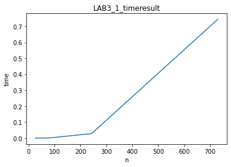
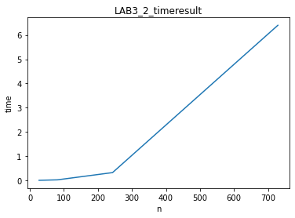

# 算法实验第三次实验报告

姓名： 费尧    学号：PB19051104  编号：96

* 实验设备和环境

设备：笔记本电脑 

环境：Windows+vs

* 实验内容及要求

  Bellman-Ford算法：

  实现求单源最短路径的Bellman-Ford算法。有向稀疏图的顶点数 N 的取值分别为: 27、81、243、729 ，每个顶点作为起点引出的边的条数取值分别为：log5N、log7N（取上整），其邻接矩阵存放在输入文件中。输入规模总共有4*2=8个，统计算法所需运行时间 ，画出时间曲线，分析程序性能。

* Johnson算法

  实现求所有点对最短路径的Johnson算法。输入数据与实验3.1相同。图的输入规模总共有4*2=8个，统计算法所需运行时间 ，画出时间曲线，分析程序性能。

* 结果与分析

1. Bellman-Ford算法：

   * 时间结果：5.01e-05s
                       4.57e-05s
                       0.0012153s
                       0.0012051s
                       0.0286415s
                       0.0282209s
                       0.749926s
                       0.738194s

     两次输入图大小相同的所用时间平均值：

     n=27 t=4.49e-05s

     n=81 t=0.0012102s

     n=243 t=0.0284312s

     n=729 t=0.744060s

   * 绘制图像：

     取两次规模相同的输入所用的时间的平均值为y轴，输入大小为x轴绘制图像：

     

     

   * 结果分析：

     本次实验中每个顶点作为起点引出的边的条数取值分别为：log5N、log7N（取上整）

     即边数E=(log5N+log7N)/2

     算法的理论时间复杂度为O(NE)=O((log5N+log7N)/2*N)=O(NlgN)

     实验结果大致符合理论值

2. Johnson算法：

   * 时间结果：

     0.0020716s
     0.0015598s
     0.0177713s
     0.0241074s
     0.322586s
     0.316685s
     6.32326s
     6.47902s
   
     平均：
   
     0.0018157s
   
     0.02093935s
   
     0.3196355s
   
     6.40114s
   
   * 绘制图像：
   
     取两次规模相同的输入所用的时间的平均值为y轴，输入大小为x轴绘制图像：
   
   * 
   
     
   
   * 结果分析：
   
     由于本算法没有用二叉堆优化Dijkstra算法，使用的是数组当做优先队列，所以Dijkstra算法的时间复杂度是O(N2)总时间复杂度达到了O(N3)这也是为什么当n=728时用时达到了6.4s
     
     